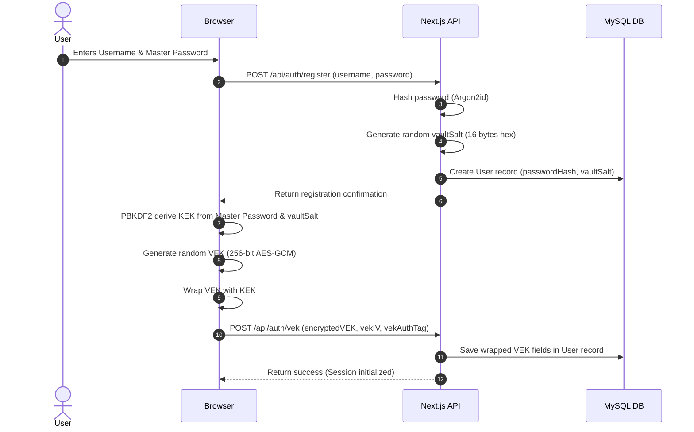
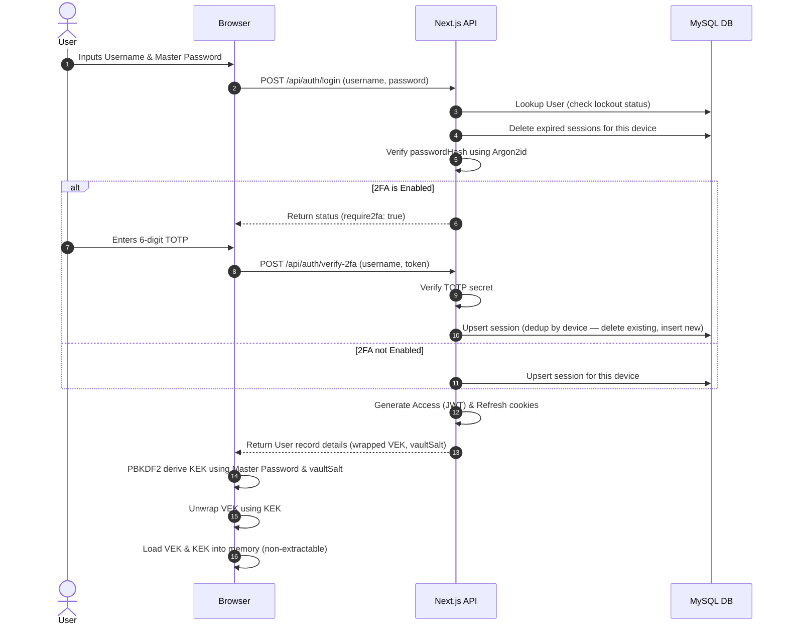
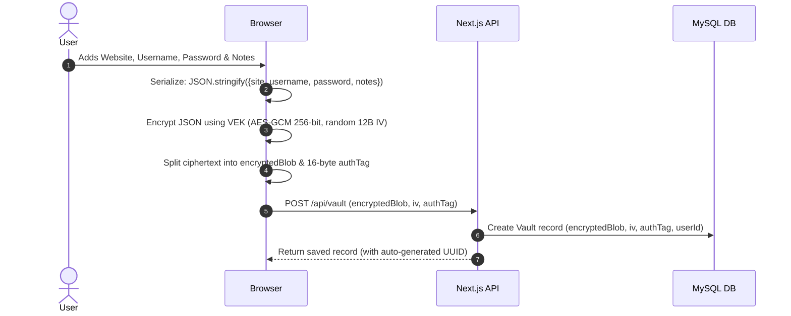
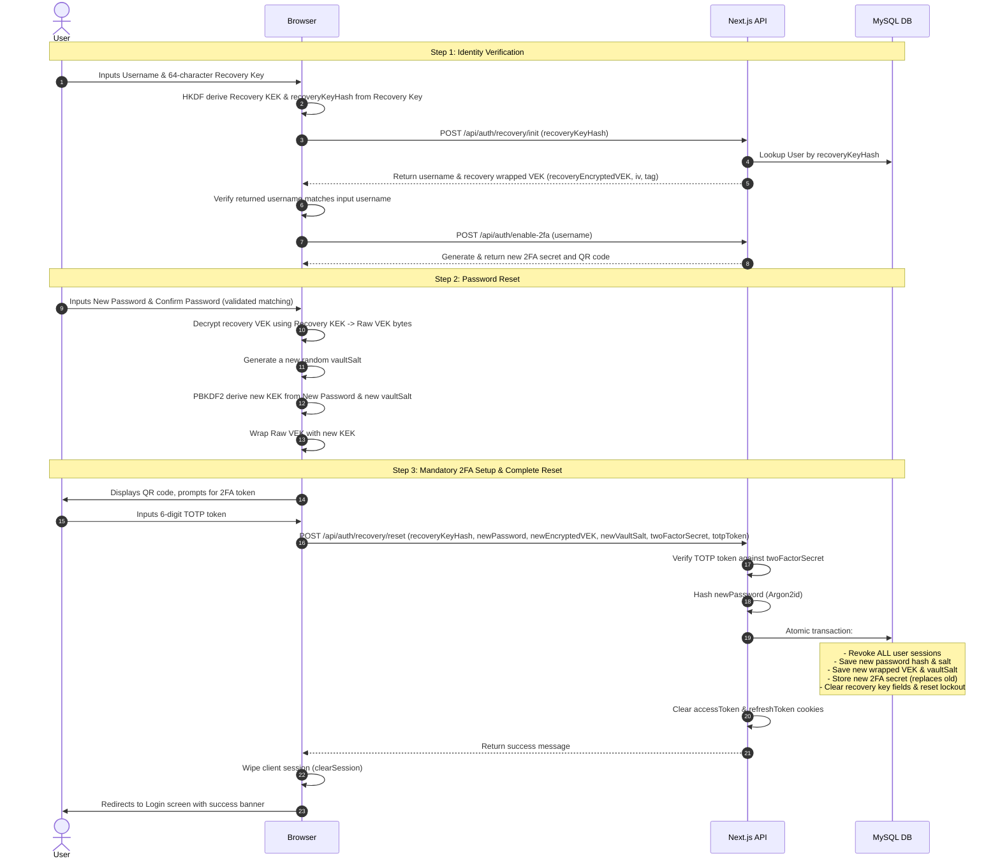

# Zero-Knowledge Password Manager

**Production URL**: [zk-password-vault.vercel.app](https://zk-password-vault.vercel.app)

## Elevator Pitch
The Zero-Knowledge Password Manager is a security-first, monorepo web application that implements local client-side AES-GCM 256-bit vault encryption, Argon2id master password hashing, TOTP-based multi-factor authentication, and a robust database-backed session management system. Built using Next.js 14 (App Router) with co-located API Route Handlers, the system enforces a strict threat model where the server is treated as completely untrusted — plaintext credentials, master passwords, and raw key material can never be accessed, decrypted, or compromised even in the event of a full database breach.

## Problem Statement
Most traditional password managers store vault items on centralized servers where a single compromise exposes millions of user credentials. Even client-side encrypted systems are prone to fatal flaws: losing the master password means losing all vault access forever. Typical architectures also require re-encrypting the entire vault whenever a user updates their master password, causing massive client overhead and widening attack windows during key rotation. Furthermore, browser-native `alert()` and `confirm()` dialogs in security-sensitive flows degrade trust and consistency.

## Motivation
This project was built to design and implement a production-grade, zero-knowledge cryptographic storage model using the modern Web Crypto API. The objective was to prove that advanced security mechanisms — such as decoupled key wrapping (KEK/VEK), ZK account recovery using HKDF-SHA256, persistent session management with device tracking, and a fully custom modal UI — can be integrated into Next.js serverless applications smoothly, securely, and with a premium user experience.

## Solution Overview
To achieve both absolute security and user flexibility, the application separates authentication from encryption using a **dual-key wrapped architecture**:
*   **Key Encryption Key (KEK):** Derived locally on the client's browser using PBKDF2-HMAC-SHA256 with 100,000 iterations from the user's Master Password and a unique `vaultSalt` fetched from the server. The master password never leaves the client device in plaintext during vault operations, and the KEK is marked as non-extractable.
*   **Vault Encryption Key (VEK):** A random 256-bit symmetric key generated client-side during registration. This key encrypts all vault items using AES-GCM.
*   **Key Wrapping:** The VEK is encrypted (wrapped) with the KEK and stored in the database. When the user changes their password, they decrypt the VEK using the old KEK and re-wrap it under a new KEK derived from the new password. This avoids re-encrypting vault items — they remain encrypted under the unchanged VEK.
*   **Zero-Knowledge Recovery:** A 256-bit high-entropy Recovery Key (64-character hex string) allows the user to derive a Recovery KEK via HKDF-SHA256. This Recovery KEK wraps a copy of the VEK on setup. During recovery, the Recovery KEK decrypts the VEK, allowing the user to set a new master password and re-wrap the VEK without the server ever seeing the keys.
*   **Mandatory 2FA Setup during Recovery:** Account recovery requires setting up a brand new 2FA configuration in Step 3 of the recovery wizard. The user must scan a new QR code and input a valid TOTP token. Only upon successful verification are the database updates applied transactionally — the old 2FA secret is replaced, the new wrapped VEK/password are saved, all prior sessions are revoked, cookies are cleared, and the user is redirected to the login screen for a fresh login.

---

## Core Features

### 1. Zero-Knowledge Cryptographic Session
The frontend utilizes a secure singleton `EncryptionService` to cache the derived KEK and VEK in memory as non-extractable CryptoKey objects. Keys are never exported to raw bytes except during local key wrapping/unwrapping, mitigating memory scraping and extension-based extraction vectors.

### 2. Client-Side Vault Encryption
Vault items (website, username, password, notes) are serialized into a JSON string, encrypted with the VEK using AES-GCM 256-bit with a unique 12-byte random initialization vector (IV) per item. The 16-byte authentication tag is extracted and stored separately for database optimization.

### 3. Password Strength & Generation
Includes an in-browser password strength analyzer that evaluates entropy, character variance, and length, providing immediate visual feedback via a color-coded bar. An integrated password generator builds cryptographically secure random passwords using `window.crypto.getRandomValues`.

### 4. Zero-Knowledge Account Recovery
A recovery system using a client-side generated 256-bit recovery key. Through HKDF-SHA256, it derives:
*   A **Recovery KEK** used to encrypt the VEK.
*   A **Recovery Identity Hash** (`recoveryKeyHash`) sent to the server as a lookup identifier. The server only knows the hash and never sees the recovery key or Recovery KEK.
*   The recovery key configuration time is persisted as `recoveryConfiguredAt` in the user's metadata.
*   The recovery process follows a 3-step wizard: identity verification, new master password creation (with client-side confirmation validation), and mandatory new 2FA setup prior to any database execution.

### 5. Multi-Factor Authentication (2FA)
Supports RFC 6238 TOTP. During setup (on the dashboard settings and during account recovery), a QR code is generated via `qrcode` and scanned using authenticator apps (e.g. Google Authenticator). Verification uses `otplib` inside co-located Next.js Route Handlers. Reconfiguring 2FA from settings requires verifying the master password first, and only overwrites the old secret upon successful TOTP verification. Upon successful reconfiguration, all user sessions are globally revoked, authentication cookies are deleted, the client session is cleared, and the user is redirected back to the login screen with a success banner requiring a fresh login.

### 6. Persistent Session Management
A database-backed session validation mechanism with full lifecycle management:
*   Upon successful login or recovery, a new session is recorded in the `Session` table using a SHA-256 hash of the JWT token, along with parsed device information (browser + OS derived from User-Agent at creation time).
*   All authenticated requests verify both the JWT signature and the existence of the matching session hash in the database.
*   Login prevents duplicate active sessions for the same device.
*   Expired sessions are cleaned up automatically during authentication.
*   Individual logout deletes the current session from the database.
*   "Logout All Devices" deletes all active sessions globally.
*   **Session revocation is also triggered on:** master password change, account recovery, 2FA reconfiguration, and account deletion (via cascade). Upon successful password change, account recovery, or 2FA reconfiguration, the client's local session is cleared, all auth cookies are deleted, and the user is redirected to the login screen for a fresh login.
*   The Active Sessions UI displays friendly device names (e.g. "Chrome on macOS") and clearly marks the current device — without exposing raw session IDs.

### 7. Custom Application Modal System
All confirmation and alert dialogs are implemented as custom in-app modals matching the dark design system — no browser-native `alert()`, `confirm()`, or `prompt()` dialogs are used anywhere in the application. The modal system supports four semantic types:
*   `danger` — Red, for destructive actions (Delete Account, Revoke Session, Logout All)
*   `warning` — Cyan + smartphone icon, for reconfigurations (Reconfigure 2FA)
*   `recovery` — Emerald + key icon, for recovery key flows (Regenerate Recovery Key)
*   `info` — Cyan, for general informational confirmations

### 8. Input Validation and Distributed Rate Limiting
*   **Input Validation:** All server API route handlers validate incoming JSON bodies against strict Zod schemas. Registration and vault creation use client-side real-time password confirmation validation.
*   **Distributed Rate Limiting:** Rate limiting on auth, 2FA, and recovery routes uses `@upstash/redis` and `@upstash/ratelimit` SDKs. IP-based rate limits (10 requests per 60 seconds) are synchronized across serverless environments. If Redis is unavailable, the limiter fails open gracefully.
*   **Double Verification:** Account Deletion requires both the Master Password and (if enabled) the TOTP token.
*   **Account Lockout:** Database-enforced 10-minute account lockout after 5 failed login attempts.

### 9. Dedicated Security Architecture Page
A polished, dedicated Security & Architecture page (`/security`) presents our security guidelines and cryptographic design in a structured, benefit-oriented layout. It details:
*   **Why** each cryptographic parameter exists (e.g. why we encrypt on your device, why we have server-blind recovery) before describing **how** it works.
*   The exact algorithms and standards used (PBKDF2-HMAC-SHA256, AES-256-GCM, HKDF-SHA256, Argon2id, and TOTP 2FA) in technical details blocks for auditability.

### 10. Global 401 Session Interceptor & Auto-Logout
To prevent generic request failure messages or broken states if a session expires or gets invalidated:
*   A global response interceptor watches for `401 Unauthorized` responses on all core API requests.
*   On catching a 401 error, it automatically clears the browser's local encryption keys (`EncryptionService.clearSession()`) and reloads the application.
*   Redirects to the login route with an `error=session-expired` parameter, rendering a red warning banner: *"Your session has expired. Please sign in again."*

---

## Architecture

The project is structured as a monorepo managed by **TurboRepo**.

```text
+---------------------------------------------------------------------------------------------------+
|                                    CLIENT BROWSER ENVIRONMENT                                     |
|                                                                                                   |
|  +---------------------------------------------------------------------------------------------+  |
|  | [apps/web] Next.js 14 Web Application (React UI)                                            |  |
|  |                                                                                             |  |
|  |  +-------------------------------------+           +-------------------------------------+  |  |
|  |  |           AuthForm Page             |           |          VaultDashboard             |  |  |
|  |  |  - Register, Login, 2FA Verification|           |  - Vault (Add/Edit/Delete Items)    |  |  |
|  |  |  - Account Recovery UI Wizard       |           |  - Account (Username, Password)     |  |  |
|  |  +------------------+------------------+           |  - Settings (2FA, Recovery, Sessions)|  |  |
|  |                     |                              +------------------+------------------+  |  |
|  |                     +------------------------+------------------------+                    |  |
|  |                                              |                                             |  |
|  |                                              v                                             |  |
|  |                                   [EncryptionService]                                      |  |
|  |                               (Session & Memory Singleton)                                 |  |
|  |                               - KEK CryptoKey (Non-extractable)                            |  |
|  |                               - VEK CryptoKey (Non-extractable)                            |  |
|  |                                                                                            |  |
|  |  +-------------------------------------------v-------------------------------------------+  |  |
|  |  | [@zk/crypto] Shared Client Crypto (window.crypto.subtle)                                |  |  |
|  |  |  PBKDF2 (KEK derive) | AES-GCM (vault enc/dec) | HKDF (recovery derive)                |  |  |
|  |  +-----------------------------------------------------------------------------------------+  |  |
|  +----------------------------------------------+----------------------------------------------+  |
+-------------------------------------------------+-------------------------------------------------+
                                                  |
                                                  | HTTPS (Axios, same-origin /api/*)
                                                  v
+---------------------------------------------------------------------------------------------------+
|                            NEXT.JS SERVERLESS ROUTE HANDLERS (apps/web)                           |
|  - Zod schema validation on all request bodies                                                   |
|  - Upstash distributed rate limiting (fail-open)                                                 |
|  - JWT + DB session hash verification on all protected endpoints                                 |
|                                                 v                                                |
|  +---------------------------------------------------------------------------------------------+  |
|  | auth.service.ts — user management, lockout, session lifecycle, recovery reset               |  |
|  | vault.service.ts — encrypted vault item CRUD                                                |  |
|  | server-auth.ts — JWT extraction + session hash verification middleware                      |  |
|  +---------------------------------------------------------------------------------------------+  |
+-------------------------------------------------|-------------------------------------------------+
                                                  |
                                                  | Prisma ORM (MySQL)
                                                  v
+---------------------------------------------------------------------------------------------------+
|                                       PERSISTENCE LAYER (MySQL)                                   |
|                                                                                                   |
|  users                                vault                    sessions                          |
|  ─────────────────────────────        ────────────────────     ────────────────────────          |
|  id (UUID, PK)                        id (UUID, PK)            id (UUID, PK)                    |
|  username (unique)                    userId (FK, cascade)     userId (FK, cascade)              |
|  passwordHash & salt (Argon2)         encryptedBlob            tokenHash (SHA-256 of JWT)        |
|  vaultSalt (KEK derivation)           iv, authTag              deviceInfo (browser + OS)         |
|  encryptedVEK, vekIV, vekAuthTag      createdAt, updatedAt     createdAt, expiresAt              |
|  recoveryKeyHash                                                                                 |
|  recoveryEncryptedVEK, iv, tag                                                                   |
|  recoveryConfiguredAt                                                                            |
|  failedLoginAttempts, lockoutUntil                                                               |
+---------------------------------------------------------------------------------------------------+
```

### Components & Workspace Structure
*   **`apps/web`:** Next.js 14 application serving the frontend UI and hosting co-located API Route Handlers.
    *   [AuthForm](file:///Users/adityadivakar/Documents/Projects/zk-password-manager/apps/web/src/components/auth-form.tsx): Manages registration, login, 2FA, and ZK account recovery wizard.
    *   [VaultDashboard](file:///Users/adityadivakar/Documents/Projects/zk-password-manager/apps/web/src/components/vault-dashboard.tsx): Manages vault items, account settings, recovery status, active sessions, and all custom application modals.
    *   [RecoverySetup](file:///Users/adityadivakar/Documents/Projects/zk-password-manager/apps/web/src/components/auth/recovery-setup.tsx): Recovery key generation and rotation modal, integrated into the settings flow.
    *   [validation.ts](file:///Users/adityadivakar/Documents/Projects/zk-password-manager/apps/web/src/lib/validation.ts): Helper for validating request bodies against Zod schemas.
    *   [auth.service.ts](file:///Users/adityadivakar/Documents/Projects/zk-password-manager/apps/web/src/lib/services/auth.service.ts): Database user management, lockout constraints, session lifecycle (create, revoke, cleanup, dedup), and recovery reset logic.
    *   [server-auth.ts](file:///Users/adityadivakar/Documents/Projects/zk-password-manager/apps/web/src/lib/server-auth.ts): JWT cookie extraction and database session hash verification middleware.
    *   [rate-limit.ts](file:///Users/adityadivakar/Documents/Projects/zk-password-manager/apps/web/src/lib/rate-limit.ts): Distributed rate limiting via Upstash Redis.
    *   [vault.service.ts](file:///Users/adityadivakar/Documents/Projects/zk-password-manager/apps/web/src/lib/services/vault.service.ts): Database queries for user vault items.
*   **`packages/crypto`:**
    *   [client.ts](file:///Users/adityadivakar/Documents/Projects/zk-password-manager/packages/crypto/src/client.ts): Client-side Web Crypto API wrappers for PBKDF2, AES-GCM, HKDF, and encoding utilities.
    *   [password.ts](file:///Users/adityadivakar/Documents/Projects/zk-password-manager/packages/crypto/src/password.ts): Server-side Argon2id password hashing and verification.
    *   [token.ts](file:///Users/adityadivakar/Documents/Projects/zk-password-manager/packages/crypto/src/token.ts): Stateless JWT sign and verify helpers.
*   **`packages/database`:** Houses the [schema.prisma](file:///Users/adityadivakar/Documents/Projects/zk-password-manager/packages/database/prisma/schema.prisma) file and exports a configured Prisma Client singleton.
*   **`packages/shared`:** Exports validation schemas ([schemas.ts](file:///Users/adityadivakar/Documents/Projects/zk-password-manager/packages/shared/src/schemas.ts)) and common TypeScript interface definitions.

---

### Data Flows

#### Registration & Initial Key Generation Flow


#### Authentication & Session Initialization Flow


#### Vault Item Encryption and Saving Flow


#### Zero-Knowledge 3-Step Account Recovery Flow


---

## Technology Stack

| Technology | Purpose | Selection Rationale |
| :--- | :--- | :--- |
| **Node.js** | Runtime | High-performance async runtime for the API backend. |
| **TypeScript** | Language | End-to-end type safety across all monorepo packages. |
| **Next.js 14** | Web Framework | Co-locates React UI and serverless API Route Handlers in a single deployment. |
| **MySQL** | Database | Relational integrity for user accounts and vault items with cascading deletes. |
| **Prisma ORM** | Database Connector | Auto-generated type-safe queries and schema-first migrations. |
| **Web Crypto API** | Client-Side Cryptography | Native browser execution with hardware-level acceleration and OS entropy. |
| **Argon2id** | Server-Side Password Hashing | Memory-hard standard resistant to GPU brute-force attacks. |
| **JWT** | Session Authentication | Stateless tokens via HttpOnly cookies; XSS-resistant. |
| **Otplib & QRCode** | Multi-Factor Authentication | RFC 6238 TOTP with QR code generation for authenticator apps. |
| **Upstash Redis** | Distributed Rate Limiting | IP-based limits synchronized across serverless instances. |
| **Zod** | Schema Validation | Runtime validation on all API payloads. |
| **TurboRepo** | Monorepo Orchestrator | Build caching, workspace management, and pipeline coordination. |

---

## Technical Challenges & Solutions

### 1. Web Crypto API Tag Slicing
*   **Challenge:** The SubtleCrypto API's `encrypt` appends the 16-byte authentication tag to the ciphertext by default. The schema separates `encryptedBlob` and `authTag` for storage optimization.
*   **Solution:** A utility `splitEncryptedData` extracts the final 16 bytes as `authTag`. During decryption, the client recombines them:
```typescript
const combined = new Uint8Array(ciphertext.length + tag.length);
combined.set(ciphertext);
combined.set(tag, ciphertext.length);
// Pass combined.buffer to window.crypto.subtle.decrypt
```

### 2. Master Password Updates without Re-encrypting Vault Items
*   **Challenge:** Encrypting items directly with a master-password-derived key would require decrypting and re-encrypting the entire vault on every password change.
*   **Solution:** Decoupled vault encryption from the master password via KEK/VEK separation. Changing the master password only re-wraps the VEK — vault records are untouched.

### 3. Server-Blind Account Recovery
*   **Challenge:** Recovering a forgotten master password traditionally requires a server-side reset, violating the zero-knowledge model.
*   **Solution:** HKDF-based recovery. The client generates a 256-bit key, derives a Recovery KEK and Identity Hash, encrypts the VEK with the Recovery KEK, and uploads only the hash and encrypted VEK. During recovery, the recovery key re-derives the KEK client-side, decrypts the VEK, and re-wraps it under a new master password — the server never sees any keys.

### 4. Stale & Duplicate Session Prevention
*   **Challenge:** Repeated logins or testing created orphaned session records in the database. JWT statelessness meant expired sessions persisted until manual cleanup.
*   **Solution:** Login now performs an upsert-style operation — it deletes any existing session for the same device before creating a new one. Expired sessions are cleaned up automatically during authentication. The `deviceInfo` field is parsed from User-Agent once at session creation and stored directly, avoiding repeated parsing.

### 5. Distributed Fail-Open Rate Limiting
*   **Challenge:** In-memory rate limiting does not scale across serverless instances. A Redis failure would block all users.
*   **Solution:** Error boundaries and timeouts on all Upstash Redis calls. On failure, the middleware logs a warning and fails open — valid authentications proceed uninterrupted.

### 6. Replacing Native Browser Dialogs
*   **Challenge:** `alert()`, `confirm()`, and `prompt()` are visually inconsistent with the app's dark design system and cannot be styled or customized.
*   **Solution:** A unified custom modal system in `VaultDashboard` with semantic types (`danger`, `warning`, `recovery`, `info`), consistent design tokens, and appropriate icons per flow. All confirmation logic is preserved via `onConfirm` callbacks.

---

## Security Considerations

### 1. Untrusted Server Threat Model
The server only stores: the Argon2id hash of the master password, a wrapped VEK (encrypted with KEK), and encrypted vault blobs (encrypted with VEK). A full database leak cannot decrypt any vault data — the decryption key (VEK) is encrypted, and the KEK is derived from the master password which is never stored.

### 2. Key Hardening and Non-Extractability
PBKDF2 runs with 100,000 iterations and HMAC-SHA256. When keys are imported via SubtleCrypto, the `extractable` parameter is set to `false`, preventing XSS payloads or browser extensions from exporting raw key bytes from the DOM.

### 3. Rate Limiting and Account Lockout
*   API Route Handlers block IPs exceeding 10 requests per minute on authentication endpoints.
*   The database tracks failed attempts. On the 5th failed attempt, the account is locked for 10 minutes via a `lockoutUntil` timestamp.

---

## Scalability Considerations

### 1. Client-Side Cryptographic Offloading
All cryptographic operations (PBKDF2 key derivation, AES-GCM encryption, HKDF, key wrapping) execute on the user's browser via the Web Crypto API, offloading CPU-intensive work from the server.

### 2. Stateless REST API
JWT tokens in HttpOnly cookies enable horizontal server scaling without session synchronization — session state is verified against the database, not server memory.

### 3. Partitioned Database Access
Vault items are associated with `userId`, enabling future table partitioning or sharding on `userId` as the shard key as the user base grows.

---

## Key Metrics & Achievements

*   **Derivation Latency:** PBKDF2 at 100,000 iterations takes ~120–180ms on standard client devices — imperceptible to users while providing strong brute-force resistance.
*   **Fixed Cryptographic Overhead:** AES-GCM adds only 28 bytes per credential (12-byte IV + 16-byte Auth Tag), minimizing storage.
*   **Online Attack Resistance:** Rate limits allow at most 14,400 auth attempts per IP per day; the 5-attempt database lockout caps active brute-force to 5 attempts per 10 minutes per targeted account.
*   **Zero Stale Sessions:** Session deduplication ensures at most one active session per device at any time.
*   **Full Modal Consistency:** All confirmation, alert, and setup dialogs use the same custom in-app design — no native browser dialogs anywhere.

---

## Lessons Learned

### 1. Asynchronous Cryptographic Pipelines
The SubtleCrypto API is asynchronous and Promise-based. Integrating cryptographic routines into React form states and lifecycle hooks requires structured loading states and error boundaries.

### 2. Key Separation Design Patterns
Decoupling data encryption keys (VEK) from key wrapping keys (KEK) is crucial for flexible ZK systems — it enables master key rotation, recovery key updates, and multi-device scenarios without modifying encrypted data payloads.

### 3. Binary Encoding over HTTP
Cryptographic keys and ciphertexts are raw `ArrayBuffer` values, which cannot be transmitted in standard JSON. Converting to Base64 for transport requires strict encode/decode utilities to prevent payload corruption.

### 4. Session Lifecycle is a Security Surface
JWT statelessness is a double-edged sword. Without database-backed session tracking and explicit revocation, tokens remain valid after logout, password changes, or recovery — creating a meaningful security gap. Database sessions with SHA-256 hashes and deduplication close this gap without sacrificing scalability.

---

## Future Improvements

*   **Offline Access Support:** Cache encrypted vault items in IndexedDB to allow offline decryption using the memory-cached VEK.
*   **Zero-Knowledge Credential Sharing:** Implement asymmetric key cryptography (RSA-OAEP or ECDH) to allow encrypted sharing of vault items between users.
*   **HaveIBeenPwned Integration:** Check saved passwords against the HIBP API using K-Anonymity (hash prefix) — entirely client-side, preserving ZK principles.
*   **Browser Auto-fill Extension:** A Chrome/Firefox extension using `@zk/crypto` to decrypt and inject credentials into login forms on saved sites.
*   **Passkey / WebAuthn Support:** Replace TOTP 2FA with hardware-backed WebAuthn for phishing-resistant authentication.

---

## Frequently Asked Questions

### 1. What does "Zero-Knowledge" mean in this context?
The server never has access to the user's plaintext passwords, master password, or decryption keys. All encryption and decryption occurs client-side in the browser. The server only stores encrypted data and hashes.

### 2. How is the master password validated during login if the server doesn't store it?
During login, the client sends the master password to the server, which runs Argon2id verification against the stored `passwordHash`. If it matches, the server confirms identity but cannot use the hash to decrypt the vault — the VEK is encrypted with a KEK derived on the client, never sent to the server.

### 3. Why use a dual-key (KEK/VEK) system instead of encrypting directly with the master password?
If the vault were encrypted directly with the master password, changing the password would require decrypting and re-encrypting every item. With KEK/VEK separation, only the VEK is re-wrapped — vault records remain unchanged.

### 4. What cipher is used for vault encryption and why?
**AES-GCM 256-bit** — an authenticated encryption algorithm that provides both confidentiality and data integrity. Any modification to the ciphertext invalidates the authentication tag, causing decryption to fail.

### 5. How does account recovery preserve ZK principles?
Recovery uses a 3-step wizard. Identity is verified client-side using the username and recovery key hash. The Recovery KEK (never seen by the server) decrypts the VEK, which is re-wrapped under a new master password KEK. All database updates happen atomically only after new 2FA is verified.

### 6. Where are encryption keys stored on the client?
Keys are held in memory as non-extractable `CryptoKey` objects inside a singleton `EncryptionService`. `extractable: false` prevents scripts from exporting raw key bytes via XSS or extension injection.

### 7. What metadata is stored in the database per user?
**User:** `id`, `username`, `passwordHash`, `salt`, `vaultSalt`, `twoFactorSecret`, `failedLoginAttempts`, `lockoutUntil`, wrapped VEK fields, recovery fields, `recoveryConfiguredAt`.  
**Session:** `id`, `userId`, `tokenHash`, `deviceInfo` (browser + OS, parsed once at creation), `createdAt`, `expiresAt`.

### 8. Why is device info parsed at session creation, not on every retrieval?
Parsing User-Agent strings on every session list request is redundant CPU work. Storing the parsed result at creation time makes reads O(1) and keeps the data consistent across the session's lifetime.

### 9. Why store the authentication tag separately from the ciphertext?
The SubtleCrypto API outputs a single buffer with the 16-byte tag appended to the ciphertext. Splitting and storing them separately optimizes relational database schema design and allows indexing on the auth tag independently if needed.

### 10. How does 2FA work during account recovery?
During Step 1 of recovery, the server pre-generates a new TOTP secret and QR code. The user scans it in Step 3 and submits the verification code. The old 2FA secret is atomically replaced only after the new code is successfully verified — preventing partial updates. After successful verification, all active sessions are globally revoked, authentication cookies are deleted, the client session is cleared, and the user is redirected to the login page for a fresh login.

### 11. Can a compromised server decrypt vault items?
No. The server only holds the encrypted VEK and encrypted vault blobs. The KEK needed to decrypt the VEK is derived from the user's master password, which is never stored on the server.

### 12. How are brute-force attacks mitigated?
Upstash Redis-backed distributed rate limiting (10 req/60s per IP) and database-enforced 5-attempt lockouts for 10 minutes per account.

### 13. How does "Logout All Devices" work?
It issues a `DELETE` on all `Session` records for the user in the database, immediately invalidating all active JWTs globally. The user is redirected to the login screen.

### 14. How are sessions deduplicated to prevent stale records?
At login/2FA verification, any existing session associated with the same device is deleted before a new session is created. Expired sessions are also cleaned up during this process.

### 15. What happens if a user loses both their master password and recovery key?
Because this is a zero-knowledge system, there is no server-side recovery path. If both credentials are lost, the vault contents are permanently unrecoverable.

### 16. Why TurboRepo?
TurboRepo provides a monorepo structure for sharing the `@zk/crypto`, `@zk/database`, and `@zk/shared` packages between the Next.js frontend and Route Handlers, while caching build and lint pipelines.

### 17. Why are custom modals used instead of browser dialogs?
Browser-native `alert()` and `confirm()` cannot be styled, are visually inconsistent with the application's dark design system, and undermine trust in security-sensitive confirmation flows. The custom modal system preserves full functionality while matching the application's design language.

---

## Quick Facts

*   **Project Type:** Monorepo Web Application
*   **Domain:** Cybersecurity / Identity & Access Management (IAM) / Cryptography
*   **Duration:** 4+ Weeks (Development, security hardening, session management, UI polish)
*   **Team Size:** 1 (Solo Developer & Security Engineer)
*   **My Role:** Full-Stack Developer & Security Engineer
*   **Tech Stack:** Next.js 14, React 18, TypeScript, Prisma ORM, MySQL, Web Crypto API, Argon2id, JWT, Upstash Redis, OTPLib, Zod, TurboRepo
*   **Key Features:** Zero-Knowledge Key Wrapping Architecture, Client-Side AES-GCM 256-bit Encryption, ZK 3-Step Account Recovery Wizard, Mandatory 2FA Verification, DB-Backed Persistent Session Management (deduplication, device info, individual/global revocation, expiry cleanup), Custom Application Modal System, Argon2id Hashing, Zod Schema Validation, Upstash Distributed Rate Limiting, Account Lockouts, Dedicated Security Architecture Page, Global 401 Session Interceptor & Auto-Logout.
