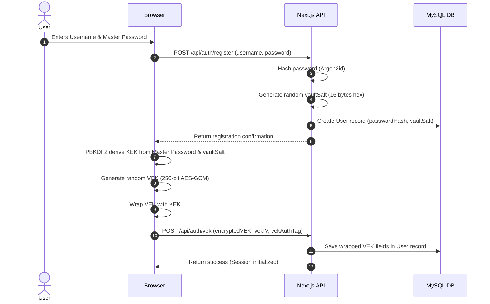
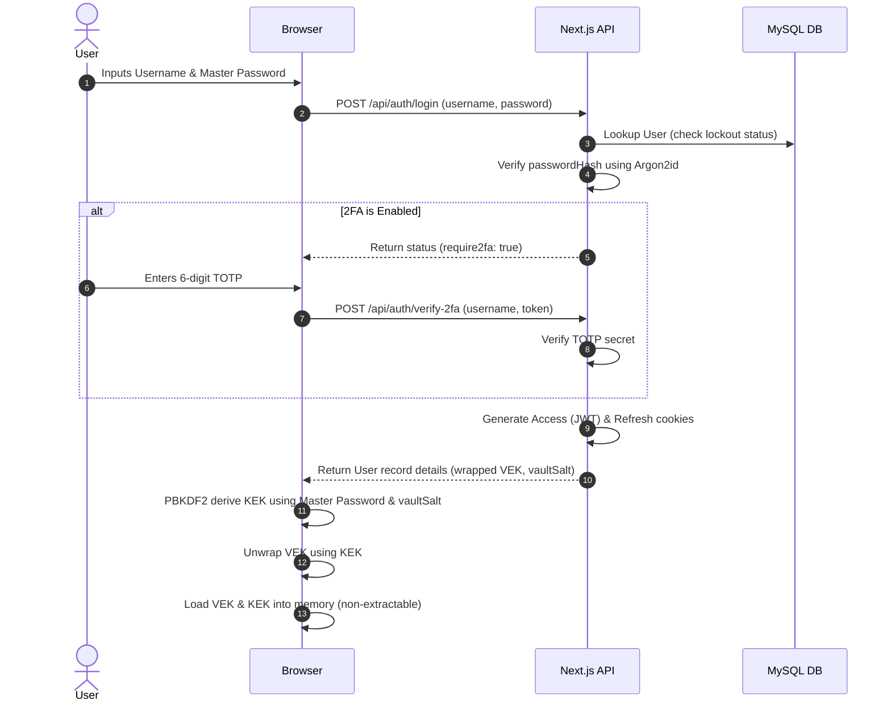
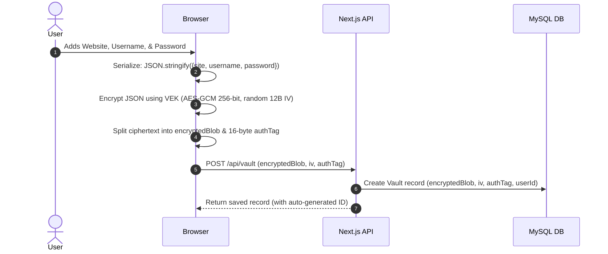
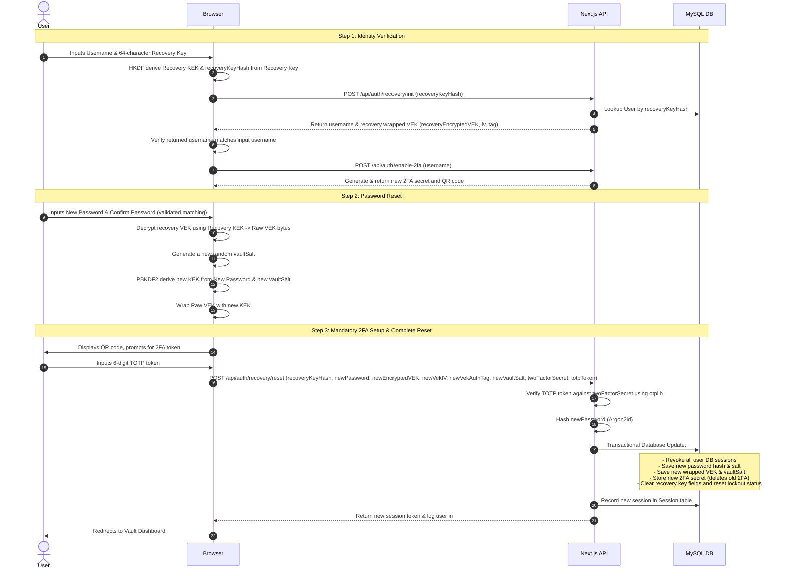

# Zero-Knowledge Password Manager

## Elevator Pitch
The Zero-Knowledge Password Manager is a security-first, monorepo web application that implements local client-side AES-GCM 256-bit vault encryption, Argon2id master password hashing on the backend, and TOTP-based multi-factor authentication. Built using Next.js 14 (App Router) with co-located API Route Handlers, the system enforces a strict threat model where the server is treated as completely untrusted, ensuring that plaintext credentials can never be accessed, decrypted, or compromised even in the event of a full database breach.

## Problem Statement
Most traditional password managers store vault items on centralized servers where a single compromise of the server or database exposes millions of user credentials. Even client-side encrypted systems are prone to fatal flaws: if a user loses their master password, they lose all access to their vault forever. Furthermore, typical architectures require re-encrypting the entire vault database whenever a user updates their master password, generating significant client-side overhead and widening attack windows during key updates.

## Motivation
This project was built to design and implement a production-grade, zero-knowledge cryptographic storage model using the modern Web Crypto API. The objective was to prove that advanced security mechanisms—such as decoupled key wrapping/unwrapping (KEK/VEK) and ZK account recovery using HKDF-SHA256 key derivation—can be integrated into Next.js serverless route handler applications smoothly and securely, demonstrating resilience against database theft, network eavesdropping, and server administrative compromises.

## Solution Overview
To achieve both absolute security and user flexibility, the application separates authentication from encryption using a **dual-key wrapped architecture**:
*   **Key Encryption Key (KEK):** Derived locally on the client's browser using PBKDF2-HMAC-SHA256 with 100,000 iterations from the user's Master Password and a unique `vaultSalt` fetched from the server. The master password never leaves the client device in plaintext during vault operations, and the KEK is marked as non-extractable.
*   **Vault Encryption Key (VEK):** A random 256-bit symmetric key generated client-side during registration. This key encrypts all vault items using AES-GCM.
*   **Key Wrapping:** The VEK is encrypted (wrapped) with the KEK and stored in the database. When the user changes their password, they decrypt the VEK using the old KEK and re-wrap it under a new KEK derived from the new password. This avoids re-encrypting the actual vault items, which remain encrypted under the unchanged VEK.
*   **Zero-Knowledge Recovery:** A 256-bit high-entropy Recovery Key (64-character hex string) allows the user to derive a Recovery KEK via HKDF-SHA256. This Recovery KEK wraps a copy of the VEK on setup. During recovery, the Recovery KEK decrypts the VEK, allowing the user to set a new master password and re-wrap the VEK under a new master KEK without the server ever seeing the keys.
*   **Mandatory 2FA Setup during Recovery:** Performing account recovery requires setting up a brand new 2FA configuration in Step 3 of the recovery process. The user is forced to scan a new QR code and input a valid TOTP token to complete the recovery. Only upon successful verification are the database updates applied transactionally (the old 2FA secret is deleted, the new one is stored, and the new wrapped VEK/password are saved), preventing password-only logins after recovery and ensuring account security.

---

## Core Features

### 1. Zero-Knowledge Cryptographic Session
The frontend utilizes a secure singleton `EncryptionService` to cache the derived KEK and VEK in memory as non-extractable CryptoKey objects. Keys are never exported to raw bytes except during local key wrapping/unwrapping, mitigating memory scraping and extension-based extraction vectors.

### 2. Client-Side Vault Encryption
Vault items (website, username, password) are serialized into a JSON string, encrypted with the VEK using AES-GCM 256-bit with a unique 12-byte random initialization vector (IV) per item. The 16-byte authentication tag appended by the Web Crypto API is extracted and stored separately for relational database optimization.

### 3. Password Strength & Generation
Includes an in-browser password strength analyzer that evaluates entropy, character variance, and length, providing immediate visual feedback via a color-coded bar. An integrated password generator builds cryptographically secure random passwords using `window.crypto.getRandomValues`.

### 4. Zero-Knowledge Account Recovery
A recovery system using a client-side generated 256-bit recovery key. Through HKDF-SHA256, it derives:
*   A **Recovery KEK** used to encrypt the VEK.
*   A **Recovery Identity Hash** (`recoveryKeyHash`) sent to the server as a lookup identifier. The server only knows the hash and never sees the recovery key or Recovery KEK.
*   The recovery key configuration time is persisted as `recoveryConfiguredAt` in the user's metadata table.
*   The recovery process follows a 3-step wizard forcing identity verification, new master password creation (including client-side confirmation validation), and mandatory new 2FA setup prior to db execution.

### 5. Multi-Factor Authentication (2FA)
Supports RFC 6238 Time-based One-Time Passwords (TOTP). During setup (both on the dashboard settings and during the mandatory 3-step account recovery wizard), a QR code is generated via `qrcode` and scanned using authenticator apps like Google Authenticator. Verification is performed using the `otplib` package inside co-located Next.js Route Handlers.

### 6. Persistent Session Management
Uses a database-backed session validation mechanism. Upon successful login or recovery, a new session is recorded in the `Session` table using a SHA-256 hash of the JWT token. All authenticated requests verify both the JWT signature and the existence of the matching session token hash in the database. Individual logouts delete the current session, and a "Logout All Devices" feature deletes all active sessions for the user. Session revocation is also triggered upon password recovery and account deletion (via cascade).

### 7. Input Validation and Distributed Rate Limiting
*   **Input Validation:** All server API route handlers validate incoming JSON bodies against strict Zod schemas. During registration and vault creation, a second password field is used for master password confirmation, validated on the client side in real-time.
*   **Distributed Rate Limiting:** Rate limiting on auth, 2FA, and recovery routes uses `@upstash/redis` and `@upstash/ratelimit` SDKs instead of in-memory maps. This keeps IP-based rate limits (10 requests per 60 seconds) synchronized across serverless environments. If the Redis backend is unavailable or unconfigured, the limiter fails open gracefully to ensure system availability.
*   **Double Verification:** Critical endpoints like Account Deletion require double verification: both the Master Password and the TOTP token must be validated.
*   **Account Lockout:** The server implements a 10-minute database-enforced account lockout after 5 failed login attempts.

---

## Architecture

The project is structured as a monorepo managed by **TurboRepo**.

```text
+---------------------------------------------------------------------------------------------------+
|                                    CLIENT BROWSER ENVIRONMENT                                     |
|                                                                                                   |
|  +---------------------------------------------------------------------------------------------+  |
|  | [apps/web] Next.js 14 Web Application (React UI)                                            |  |
|  |                                                                                             |  |
|  |  +-------------------------------------+           +-------------------------------------+  |  |
|  |  |           AuthForm Page             |           |          VaultDashboard             |  |  |
|  |  |  - Register, Login, 2FA Verification|           |  - Add/Edit Credentials             |  |  |
|  |  |  - Account Recovery UI Trigger      |           |  - Account Deletion & Recovery Setup|  |  |
|  |  +------------------+------------------+           +------------------+------------------+  |  |
|  |                     |                                                 |                    |  |
|  |                     +------------------------+------------------------+                    |  |
|  |                                              |                                             |  |
|  |                                              v                                             |  |
|  |                                   [EncryptionService]                                      |  |
|  |                               (Session & Memory Singleton)                                 |  |
|  |                               - KEK CryptoKey (Non-extractable)                            |  |
|  |                               - VEK CryptoKey (Non-extractable)                            |  |
|  |                                                                                            |  |
|  |                                   (Invokes Crypto Helpers)                                 |  |
|  |  +-------------------------------------------v-------------------------------------------+  |  |
|  |  | [@zk/crypto] Shared Client Crypto (client.ts wrapping window.crypto.subtle)             |  |  |
|  |  |                                                                                         |  |  |
|  |  |   +-----------------------+     +-----------------------+     +---------------------+   |  |  |
|  |  |   |        PBKDF2         |     |        AES-GCM        |     |        HKDF         |   |  |  |
|  |  |   | (100k Iterations KEK) |     | (256-bit VEK Enc/Dec) |     | (Recovery Derive)   |   |  |  |
|  |  |   +-----------------------+     +-----------------------+     +---------------------+   |  |  |
|  |  +-----------------------------------------------------------------------------------------+  |  |
|  +----------------------------------------------+----------------------------------------------+  |
+-------------------------------------------------+-------------------------------------------------+
                                                  |
                                                  | HTTPS API Calls (Axios to same-origin /api/*)
                                                  v
+---------------------------------------------------------------------------------------------------+
|                            NEXT.JS SERVERLESS ROUTE HANDLERS (apps/web)                           |
|                                                                                                   |
|  +---------------------------------------------------------------------------------------------+  |
|  | API Routing: /api/auth/* & /api/vault/*                                                     |  |
|  | - Enforces Zod Schema Validation on incoming JSON request payloads                          |  |
|  | - Performs IP-based Distributed Rate Limiting (via Upstash Redis with fail-open fallback)    |  |
|  +----------------------------------------------+----------------------------------------------+  |
|                                                 |
|                                                 v
|  +---------------------------------------------------------------------------------------------+  |
|  | Services Layer (src/lib/services/auth.service.ts & src/lib/services/vault.service.ts)       |  |
|  |                                                                                             |  |
|  |   +--------------------------------------+       +---------------------------------------+  |  |
|  |   |           Server Cryptography        |       |    Persistent Session Management      |  |  |
|  |   |   - Argon2id Password Hashing        |       |   - Validate JWT & DB Session Hash    |  |  |
|  |   |   - DatabaseLockout Verification     |       |   - Individual / All Devices Revoke   |  |  |
|  |   +--------------------------------------+       +---------------------------------------+  |  |
|  +----------------------------------------------+----------------------------------------------+  |
+-------------------------------------------------|-------------------------------------------------+
                                                  |
                                                  | Prisma ORM Queries (Prisma Singleton)
                                                  v
+---------------------------------------------------------------------------------------------------+
|                                       PERSISTENCE LAYER (MySQL)                                   |
|                                                                                                   |
|  +---------------------------------------------+   +-------------------------------------------+  |
|  |                "users" Table                |   |               "vault" Table               |  |
|  |  - id (UUID, Primary Key)                   |   |  - id (UUID, Primary Key)                 |  |
|  |  - username (Unique string)                 |   |  - userId (Foreign Key, Cascade)          |  |
|  |  - passwordHash & salt (Argon2 values)      |   |  - encryptedBlob (AES-GCM ciphertext)     |  |
|  |  - vaultSalt (KEK derivation salt)          |   |  - iv (Initialization Vector bytes)       |  |
|  |  - encryptedVEK, vekIV, vekAuthTag (Wrapped)|   |  - authTag (AES-GCM Authentication)      |  |
|  |  - recoveryKeyHash (HKDF Hash lookup)       |   |  - createdAt & updatedAt                  |  |
|  |  - recoveryEncryptedVEK, iv, tag (Rec-wrap) |   +-------------------------------------------+  |
|  |  - recoveryConfiguredAt (Setup timestamp)   |                                                  |
|  |  - failedLoginAttempts & lockoutUntil       |   +-------------------------------------------+  |
|  +----------------------+----------------------+   |             "sessions" Table              |  |
|                         |                          |  - id (UUID, Primary Key)                 |  |
|                         | Has many                 |  - userId (Foreign Key, Cascade)          |  |
|                         v                          |  - tokenHash (SHA-256 of JWT)             |  |
|                  (Sessions Relation)               |  - createdAt & expiresAt                  |  |
|                         +------------------------->+-------------------------------------------+  |
+---------------------------------------------------------------------------------------------------+
```

### Components & Workspace Structure
*   **`apps/web`:** Next.js 14 application serving the frontend UI and hosting co-located Next.js API route handlers.
    *   [AuthForm](file:///Users/adityadivakar/Documents/Projects/zk-password-manager/apps/web/src/components/auth-form.tsx): Manages registration, login, 2FA, and ZK account recovery.
    *   [VaultDashboard](file:///Users/adityadivakar/Documents/Projects/zk-password-manager/apps/web/src/components/vault-dashboard.tsx): Manages items, settings, recovery status, and password tools.
    *   [validation.ts](file:///Users/adityadivakar/Documents/Projects/zk-password-manager/apps/web/src/lib/validation.ts): Helper for validating request bodies against schemas.
    *   [auth.service.ts](file:///Users/adityadivakar/Documents/Projects/zk-password-manager/apps/web/src/lib/services/auth.service.ts): Implements database user management, lockout constraints, sessions, and recovery reset logic.
    *   [rate-limit.ts](file:///Users/adityadivakar/Documents/Projects/zk-password-manager/apps/web/src/lib/rate-limit.ts): Distributed rate limiting implementation using Upstash Redis.
    *   [vault.service.ts](file:///Users/adityadivakar/Documents/Projects/zk-password-manager/apps/web/src/lib/services/vault.service.ts): Handles database query execution for user vault items.
*   **`packages/crypto`:**
    *   [client.ts](file:///Users/adityadivakar/Documents/Projects/zk-password-manager/packages/crypto/src/client.ts): Client-side Web Crypto API wrappers for PBKDF2, AES-GCM, and encoding utilities.
    *   [password.ts](file:///Users/adityadivakar/Documents/Projects/zk-password-manager/packages/crypto/src/password.ts): Server-side Argon2id password hashing and verification.
    *   [token.ts](file:///Users/adityadivakar/Documents/Projects/zk-password-manager/packages/crypto/src/token.ts): Stateless JWT sign and verify helpers.
*   **`packages/database`:** Houses the [schema.prisma](file:///Users/adityadivakar/Documents/Projects/zk-password-manager/packages/database/prisma/schema.prisma) file and exports a configured Prisma Client.
*   **`packages/shared`:** Exports validation schemas ([schemas.ts](file:///Users/adityadivakar/Documents/Projects/zk-password-manager/packages/shared/src/schemas.ts)) and common TypeScript interface definitions.

---

### Data Flows

#### Registration & Initial Key Generation Flow


#### Authentication & Session Initialization Flow


#### Vault Item Encryption and Saving Flow


#### Zero-Knowledge 3-Step Account Recovery Flow


---

## Technology Stack

| Technology | Purpose | Selection Rationale |
| :--- | :--- | :--- |
| **Node.js** | Runtime Environment | High-performance asynchronous runtime for scaling the API backend. |
| **TypeScript** | Language | Enables end-to-end type safety, preventing configuration mismatches between packages. |
| **Next.js 14** | Web Framework | Co-locates the React UI and API Route Handlers in a single serverless deployment package. |
| **MySQL** | Database | Relational database ideal for storing structured user accounts and indexed vault items with cascading deletions. |
| **Prisma ORM** | Database Connector | Auto-generates type-safe database queries and migration tools directly from the database schema. |
| **Web Crypto API** | Client-Side Cryptography | Native browser execution ensures key derivation and encryption utilize hardware-level acceleration and OS-level entropy. |
| **Argon2id** | Server-Side Password Hashing | Current cryptographic standard (Argon2id), configured with memory-hard parameters to resist GPU-based brute-force attacks. |
| **JWT** | Session Authentication | Stateless JSON Web Tokens sent via HttpOnly cookies prevent XSS theft and scale without database session lookups. |
| **Otplib & QRCode** | Multi-Factor Authentication | Compliant implementation of RFC 6238 TOTP protocols, offering visual integration for Google Authenticator. |
| **TurboRepo** | Monorepo Orchestrator | Speeds up multi-package workflows, manages dependencies across workspaces, and caches test/build pipelines. |

---

## Technical Challenges & Solutions

### 1. Web Crypto API Tag Slicing
*   **Challenge:** The SubtleCrypto API's `encrypt` function for AES-GCM appends the 16-byte authentication tag to the ciphertext buffer by default. The Prisma schema, designed for compatibility with storage optimization guidelines, separates `encryptedBlob` and `authTag`.
*   **Solution:** Created a utility `splitEncryptedData` that extracts the final 16 bytes of the generated ArrayBuffer as the `authTag` and maps the remaining bytes to the `encryptedBlob`. During decryption, the client slices the buffers and joins them back together:
```typescript
const combined = new Uint8Array(ciphertext.length + tag.length);
combined.set(ciphertext);
combined.set(tag, ciphertext.length);
// Pass combined.buffer to window.crypto.subtle.decrypt
```

### 2. Master Password Updates without Re-encrypting Vault Items
*   **Challenge:** If all vault items were encrypted directly using a key derived from the master password, changing the master password would require the client to fetch all passwords, decrypt them, derive a new key, re-encrypt every item, and upload them back. This causes massive memory spikes, high network payloads, and risks corrupting data if the connection drops.
*   **Solution:** Decoupled vault encryption from the master password. All items are encrypted with a random Vault Encryption Key (VEK). The VEK is encrypted (wrapped) with the master password-derived KEK. Changing the master password only requires decrypting the VEK, generating a new salt, deriving a new KEK, re-wrapping the VEK, and saving it to the server. The vault records remain unchanged.

### 3. Server-Blind Account Recovery
*   **Challenge:** If a user loses their master password, resetting it requires a recovery mechanism. Traditional mechanisms involve server-side resets, violating the zero-knowledge threat model.
*   **Solution:** Developed an HKDF-based recovery process. When the user sets up recovery, the client generates a 256-bit key. Using HKDF, it derives a Recovery KEK and an Identity Hash. The client encrypts the VEK with the Recovery KEK and uploads it along with the Identity Hash. During recovery, the recovery key recreates the Recovery KEK and the Identity Hash on the client, fetches the recovery-wrapped VEK, decrypts it, and re-wraps it with a KEK derived from a new master password.

### 4. Persistent Session Revocations & DB Sync
*   **Challenge:** JWT tokens are stateless, meaning once issued they cannot be easily revoked prior to their expiration. If a user logs out, recovers their account, or deletes their account, any active JWTs remained valid, violating the security model.
*   **Solution:** Implemented a database-backed persistent `Session` table. A SHA-256 hash of every active token is stored in the database. During route middleware authentication, the handler checks both the JWT signature and queries the DB to verify the hash matches an active session. Logouts, account recovery, and account deletions cascade delete the session entries, rendering old JWTs instantly useless.

### 5. Distributed Fail-Open Rate Limiting
*   **Challenge:** Traditional in-memory rate-limit structures do not scale horizontally across serverless environments. Replacing them with a central distributed Redis instance (Upstash) ensures state sharing but introduces a single point of failure: if Upstash becomes unreachable, users must not be locked out of their accounts.
*   **Solution:** Implemented error boundaries and timeouts on all `@upstash/redis` API invocations. If a Redis lookup fails or times out, the middleware catches the exception, logs a warning, and "fails open"—allowing valid authentications to proceed uninterrupted.

---

## Security Considerations

### 1. Untrusted Server Threat Model
The server only stores:
*   The Argon2id hash of the master password.
*   A wrapped VEK (encrypted with KEK).
*   Encrypted vault blobs (encrypted with VEK).
If the server's database is leaked, attackers cannot decrypt the passwords because the decryption key (VEK) is encrypted, and the KEK is derived from the master password, which is never stored on the server.

### 2. Key Hardening and Non-Extractability
Master password derivation utilizes PBKDF2 with 100,000 iterations and HMAC-SHA256, adding computational overhead that slows down dictionary attacks. When importing keys via the SubtleCrypto API, the `extractable` parameter is set to `false`. This prevents malicious scripts or XSS payloads from extracting raw key bytes from the DOM.

### 3. Rate Limiting and Account Lockout
To block online brute-force attempts:
*   The API Route Handlers block traffic from IPs exceeding 10 requests per minute on authentication endpoints.
*   The database tracks failed attempts. On the 5th failed attempt, the server locks the account for 10 minutes by setting a `lockoutUntil` timestamp.

---

## Scalability Considerations

### 1. Client-Side Cryptographic Offloading
Cryptographic operations (PBKDF2 key derivation, AES-GCM encryption, key wrapping) are executed on the user's browser via the Web Crypto API. This offloads CPU-intensive operations from the server, allowing the backend to scale easily.

### 2. Stateless REST API
The server manages session authentication using stateless JWT tokens transmitted via HTTP-only cookies. Because session states are not stored in memory, the backend can be horizontally scaled behind a load balancer without session synchronization issues.

### 3. Partitioned Database Access
The database schema separates user credentials from vault entries. Since vault items are associated with a specific `userId`, the vault table can be partitioned or sharded using the `userId` as the shard key, facilitating scaling as the user base grows.

---

## Key Metrics & Achievements

*   **Derivation Latency:** PBKDF2 runs at 100,000 iterations, taking approximately 120ms to 180ms on standard client devices. This provides high security with minimal impact on user experience.
*   **Fixed Cryptographic Overhead:** AES-GCM adds only a 28-byte overhead (12-byte IV + 16-byte Auth Tag) per saved credential, minimizing database storage requirements.
*   **Online Attack Resistance:** IP rate limits restrict brute-force attempts to a maximum of 14,400 queries per day, while the 5-attempt database lockout reduces active attempts to 5 per 10 minutes per targeted account.
*   **Robust Test Coverage:** An automated recovery test script (`test-recovery.ts`) performs registration, 2FA, key wrapping, rotation, and recovery key resets, verifying the integrity of the cryptographic pipeline.

---

## Lessons Learned

### 1. Asynchronous Cryptographic Pipelines
The SubtleCrypto API is asynchronous and relies on Promises. Integrating asynchronous cryptographic routines into standard React form states and lifecycle hooks requires structured loading states and error boundaries to prevent UI rendering issues.

### 2. Key Separation Design Patterns
Decoupling data encryption keys (VEK) from key wrapping keys (KEK) is crucial for building flexible ZK systems. It allows for master key rotation, recovery key updates, and multi-device key syncing without modifying the encrypted data payloads.

### 3. Binary Encoding over HTTP
Cryptographic keys and ciphertexts are raw byte arrays (`ArrayBuffer`), which cannot be transmitted in standard JSON bodies. Converting these arrays to Base64 strings for network transport requires strict encoding and decoding utilities to prevent payload corruption.

---

## Future Improvements

*   **Offline Access Support:** Cache the encrypted vault items in IndexedDB or LocalStorage, enabling users to decrypt and search their vault offline using the memory-cached VEK.
*   **Zero-Knowledge Credential Sharing:** Implement asymmetric key cryptography (RSA-OAEP or ECDH) to allow users to encrypt and share vault items with other users.
*   **HaveIBeenPwned Integration:** Connect to the HaveIBeenPwned API to monitor saved passwords for public breaches, checking the hashed prefix (K-Anonymity) locally on the client.
*   **Browser Auto-fill Extension:** Develop a Chrome/Firefox extension that injects the `@zk/crypto` library to decrypt credentials and automatically populate login forms on saved sites.

---

## Frequently Asked Questions

### 1. What does "Zero-Knowledge" mean in the context of this password manager?
Zero-Knowledge means the application is designed so that the server hosting the database and processing API requests never has access to the user's plaintext passwords, master password, or decryption keys. All encryption and decryption operations occur client-side on the user's browser. The server only stores encrypted data and hashes.

### 2. How is the master password validated during login if the server doesn't know it?
During login, the client sends the master password to the server. The server runs the Argon2id verification algorithm against the stored `passwordHash`. If it matches, the server confirms the user's identity. While the server temporarily processes the password in memory during authentication, it does not store it. Crucially, the server cannot use the password hash to decrypt the vault, as the decryption key (VEK) is encrypted with a KEK derived on the client and is never sent to the server.

### 3. Why does the application use a dual-key (KEK and VEK) system instead of encrypting the vault directly with the master password?
Using a dual-key system decouples vault item encryption from the master password. If the vault were encrypted directly with the master password, changing the password would require decrypting every vault item and re-encrypting it with the new key. With a KEK and VEK architecture, only the VEK is wrapped by the KEK. Changing the master password only requires decrypting and re-encrypting the single VEK key.

### 4. What cryptographic algorithm is used for vault encryption, and why was it chosen?
The vault items are encrypted using **AES-GCM (Galois/Counter Mode) 256-bit**. AES-GCM is an authenticated encryption algorithm that provides both confidentiality and data integrity. It prevents attackers from modifying the ciphertext (tampering) because any modification invalidates the 16-byte authentication tag, causing decryption to fail.

### 5. How does the account recovery system work without compromising ZK principles?
Account recovery uses a 3-step wizard. First, identity is verified using the username and the client-derived recovery key hash. Next, the client decrypts the recovery-wrapped VEK using the derived Recovery KEK and re-wraps it under a new KEK derived from a new master password. Finally, the user must set up a new mandatory 2FA secret. All database updates—including resetting the master password, updating the wrapped VEK, saving the new 2FA secret, and revoking all prior sessions—are processed on the server in a single database transaction only after the new 2FA TOTP code is successfully verified.

### 6. Where are the encryption keys stored on the client, and how are they secured against extraction?
Keys are held in memory as non-extractable `CryptoKey` objects inside a singleton `EncryptionService`. When a key is marked as non-extractable (`extractable: false`), the browser's SubtleCrypto engine prevents scripts from exporting the raw key bytes, mitigating the risk of key extraction via XSS or browser extension sniffing.

### 7. What is the difference between PBKDF2 and Argon2id in this application?
*   **PBKDF2-HMAC-SHA256 (Client-Side):** Used for master password key derivation because it is supported natively by the browser Web Crypto API, runs asynchronously without external libraries, and provides sufficient key stretching.
*   **Argon2id (Server-Side):** Used for password hashing on the backend. It is the modern standard for password hashing, designed to resist GPU-based cracking attacks.

### 8. What metadata is stored in the database for each user?
The database stores user profiles, their encrypted keys, recovery information, and active sessions:
*   **User model fields:** `id` (UUID), `username`, `passwordHash`, `salt` (Argon2 password salt), `vaultSalt` (salt used for KEK derivation), `twoFactorSecret` (TOTP secret key), `failedLoginAttempts`, `lockoutUntil` (lockout metrics), wrapped VEK fields (`encryptedVEK`, `vekIV`, `vekAuthTag`), recovery fields (`recoveryKeyHash`, `recoveryEncryptedVEK`, `recoveryVekIV`, `recoveryVekAuthTag`), and `recoveryConfiguredAt`.
*   **Session model fields:** Active database-backed persistent sessions associated with each user: `id` (UUID), `userId` (cascade-deleted relation to User), `tokenHash` (SHA-256 hash of the session token), `createdAt`, and `expiresAt`.

### 9. Why are the ciphertext and the authentication tag split into separate database fields?
The Web Crypto API's `encrypt` function outputs a single buffer containing the ciphertext with the 16-byte authentication tag appended. To optimize database storage, the client slices the last 16 bytes off the buffer as the `authTag`, storing the preceding bytes as the `encryptedBlob`. During decryption, the client recombines these buffers.

### 10. How is multi-factor authentication (2FA) enforced in the application?
The application implements TOTP (RFC 6238). During setup (both on the settings screen and during the 3-step account recovery wizard), the server generates a secret key and a QR code. When the user logs in (or completes recovery), the server verifies the 6-digit code using `otplib` before granting/reserving access.

### 11. Can a compromised API server decrypt a user's vault items?
No. The API server only has access to the database containing the encrypted vault items and the encrypted VEK. The key required to decrypt the VEK (the KEK) is derived from the user's master password, which is never stored on the server.

### 12. How does the application protect against online brute-force attacks?
To prevent brute-force attacks:
*   Distributed rate-limiting using `@upstash/redis` and `@upstash/ratelimit` restricts clients to 10 requests per minute per IP on authentication routes (login, registration, 2FA, and recovery).
*   The database tracks failed attempts. On the 5th failed attempt, the account is locked for 10 minutes.

### 13. What is the role of `vaultSalt` in the User model?
The `vaultSalt` is a cryptographically secure random value generated during registration. It is used as the salt parameter in PBKDF2 to derive the KEK from the master password. This ensures that two users with the same master password will derive different KEKs, preventing rainbow table attacks.

### 14. Why is the database lockout timestamp stored in the database rather than in-memory?
Storing the lockout status (`lockoutUntil` and `failedLoginAttempts`) in the MySQL database ensures that the lockout persists across server restarts and is enforced consistently across multi-server horizontal configurations.

### 15. How are session tokens managed?
Upon successful login or recovery, the server issues a JWT access token (valid for 15 minutes) and stores a SHA-256 hash of the token in the `Session` database table. These tokens are transmitted to the client in HttpOnly, Secure, SameSite=Strict cookies. For all authenticated actions, the server validates the JWT signature and verifies that the session hash remains active in the database. This allows instant, granular session revocation on logout, "Logout All Devices" triggers, and password resets.

### 16. What is the performance impact of client-side key derivation?
Deriving a KEK using PBKDF2 with 100,000 iterations takes approximately 120ms to 180ms on standard client devices. This delay is imperceptible to users during login but provides a significant barrier against online brute-force cracking attempts.

### 17. How does the delete account feature ensure data is safely removed?
When a user deletes their account, the client requests validation by prompting for both the master password and a 2FA code (if enabled). Upon verification, the server executes a cascading database delete, removing the user's record (which cascades to delete all associated sessions) and all encrypted vault items.

### 18. What happens if a user loses both their master password and their recovery key?
Because this is a zero-knowledge system, there is no way for the server administrators to recover or decrypt the user's data. If both the master password and the recovery key are lost, the vault contents are permanently unrecoverable.

### 19. Why was TurboRepo chosen for this project?
TurboRepo provides a monorepo structure that allows sharing the `@zk/crypto` library, `@zk/database` package, and `@zk/shared` schemas between the Next.js frontend pages and Route Handlers. It optimizes build and lint pipelines by caching output artifacts.

### 20. What security measures are taken to secure the API Route Handlers against unauthorized access?
The API secures all protected endpoints using cookie token extraction. The handler intercepts requests, extracts the JWT access token from the cookies, and validates its signature. If the token is missing, invalid, or the session hash has been revoked from the database, the request is rejected with a 401 status code.

---

## Quick Facts

*   **Project Type:** Monorepo Web Application
*   **Domain:** Cybersecurity / Identity & Access Management (IAM) / Cryptography
*   **Duration:** 4 Weeks (Intense development, migration, and security hardening)
*   **Team Size:** 1 (Solo Developer & Security Engineer)
*   **My Role:** Full-Stack Developer & Security Engineer
*   **Tech Stack:** Next.js 14, React 18, TypeScript, Prisma ORM, MySQL, Web Crypto API, Argon2id, JWT, Upstash Redis, OTPLib, Zod, TurboRepo
*   **Key Features:** Zero-Knowledge Key Wrapping Architecture, Client-Side AES-GCM 256-bit Encryption, ZK 3-Step Account Recovery Wizard, Mandatory 2FA Verification, DB-Backed Persistent Session Management (Individual/Global Revocation), Argon2id Hashing, Server-Side Zod Schemas Verification, Upstash Distributed Rate Limiting, and Account Lockouts.
