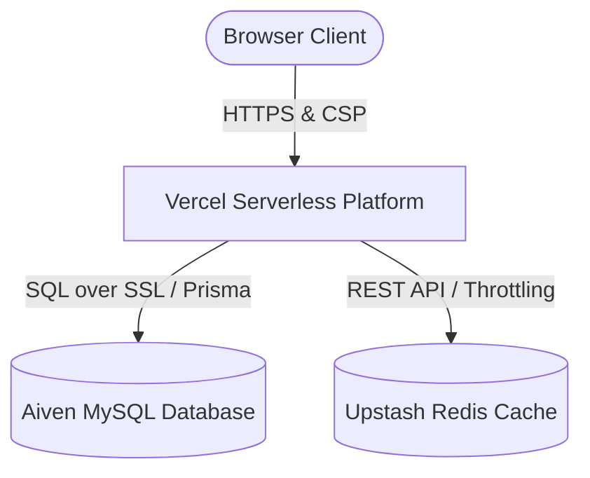

# Deployment & Infrastructure Documentation

This document provides a detailed breakdown of the infrastructure setup, environment configurations, and the technical hurdles resolved during the production deployment of the Zero-Knowledge Vault monorepo.

---

## 1. Infrastructure Architecture

The application is architected as a secure, zero-knowledge password manager deployed on a distributed, serverless infrastructure:



### 1.1. Hosted Relational Database (Aiven MySQL)
* **Purpose**: Primary database layer containing relational tables for users, encrypted vault blobs, and authenticated active sessions.
* **Security & SSL**: Since data is transferred over public networks between Vercel’s serverless functions and the database server, secure connections are strictly enforced. The connection URL uses SSL enforcement:
  `mysql://<username>:<password>@<host>:<port>/<dbname>?ssl-mode=REQUIRED`
  This configuration requires that all handshakes utilize TLS encryption, blocking cleartext MITM vectors.

### 1.2. Request Throttling & Caching (Upstash Redis)
* **Purpose**: Distributed rate limiting of authentication endpoints.
* **Mechanism**: Utilizes Upstash Redis (configured via `UPSTASH_REDIS_REST_URL` and `UPSTASH_REDIS_REST_TOKEN`) to track IP and username request frequencies inside serverless middleware and API routes. This prevents brute-force attacks against master password validation and user registration endpoints.

### 1.3. Serverless Next.js Application (Vercel)
* **Purpose**: Hosts the App Router user interface and API backend routes under a monorepo structure.
* **Build Mechanism**: Automatically builds using Next.js Standalone mode (`output: "standalone"`) which creates a trimmed, production-ready bundle containing only the necessary workspace files and dynamic node modules.

---

## 2. Compilation of Deployment Issues & Technical Solutions

During the deployment process, we resolved several production-readiness issues. Below is a detailed look at each problem and its solution.

---

### Issue 1: Hydration Crash & Content Security Policy (CSP) Headers

* **Symptoms**: The landing page was stuck in a static, perpetual "Loading..." state. The browser console displayed errors indicating inline scripts were blocked due to Content-Security-Policy violations.
* **Root Cause**: Next.js App Router relies on injecting inline bootstrap scripts (such as `self.__next_f.push` streaming scripts) to hydrate React components. The production CSP in [next.config.js](file:///Users/adityadivakar/Documents/Projects/zk-password-manager/apps/web/next.config.js) was strictly set to `script-src 'self'`, which blocked Next.js from executing its own bootstrap code.
* **Solution**: Updated the CSP header configuration in [next.config.js](file:///Users/adityadivakar/Documents/Projects/zk-password-manager/apps/web/next.config.js) to allow `'unsafe-inline'` scripts in production, while retaining strict source constraints on other assets:
  ```javascript
  const cspValue = isProd
      ? "default-src 'self'; script-src 'self' 'unsafe-inline'; style-src 'self' 'unsafe-inline'; img-src 'self' data:; font-src 'self' data:; connect-src 'self'; object-src 'none'; base-uri 'self'; form-action 'self'; frame-ancestors 'none';"
      : "...";
  ```

---

### Issue 2: Turborepo Environment Variable Stripping

* **Symptoms**: The production build compiled successfully, but at runtime, the Prisma client failed to connect to the database, and the rate limiter returned `undefined` configuration errors.
* **Root Cause**: Turborepo compiles tasks in a highly sandboxed, isolated container environment to ensure cache safety. By default, it strips out all environment variables from the build task execution context unless they are explicitly declared in the pipelines.
* **Solution**: Updated the root [turbo.json](file:///Users/adityadivakar/Documents/Projects/zk-password-manager/turbo.json) to declare the required environment variables in the `build` task's `env` list:
  ```json
  "tasks": {
      "build": {
          "dependsOn": ["^build"],
          "outputs": ["dist/**", ".next/**", "!.next/cache/**"],
          "env": [
              "DATABASE_URL",
              "JWT_SECRET",
              "UPSTASH_REDIS_REST_URL",
              "UPSTASH_REDIS_REST_TOKEN",
              "NODE_ENV"
          ]
      }
  }
  ```

---

### Issue 3: C++ Native Dependency (`argon2`) Bundling Crash

* **Symptoms**: The serverless authentication routes crashed on Vercel with `500 Server Error`, printing:
  `Error: No native build was found for platform=linux arch=x64 runtime=node`
* **Root Cause**: `argon2` utilizes native C++ bindings which must be compiled for the target server environment (`platform=linux arch=x64`). Next.js's Webpack compiler attempted to bundle the `argon2` module directly into the Next.js Javascript bundle, which stripped away its platform-specific binary bindings (`.node` files).
* **Solution**: 
  1. Add `argon2` to the `experimental.serverComponentsExternalPackages` array in [next.config.js](file:///Users/adityadivakar/Documents/Projects/zk-password-manager/apps/web/next.config.js). This tells Webpack to exclude `argon2` from compilation and import it as a standard external module.
  2. Declare `"argon2": "^0.44.0"` as a direct dependency in [apps/web/package.json](file:///Users/adityadivakar/Documents/Projects/zk-password-manager/apps/web/package.json) so Vercel installs the compiled Linux binary directly into the serverless deployment container.
  3. Add `outputFileTracingIncludes` rules to copy `argon2/prebuilds/**/*` to the standalone build output folder.

---

### Issue 4: Node.js Runtime Version Mismatch (ABI Mismatch)

* **Symptoms**: Even with external bundling configured, Vercel routes still threw `No native build was found for ... abi=137 node=24.14.1` or related ABI loading errors.
* **Root Cause**: The build container and execution serverless functions on Vercel were running different Node.js runtime versions. `argon2` compiled native binaries during the build step on Node 20 (ABI 120) but Vercel executed them on Node 24 (ABI 137), leading to binary load failures.
* **Solution**: Locked the Node.js version across both the monorepo root [package.json](file:///Users/adityadivakar/Documents/Projects/zk-password-manager/package.json) and the Next.js [apps/web/package.json](file:///Users/adityadivakar/Documents/Projects/zk-password-manager/apps/web/package.json) using the `engines` field:
  ```json
  "engines": {
      "node": "20.x"
  }
  ```
  This forces Vercel to build and run the serverless functions on the exact same Node 20.x runtime, ensuring binary compatibility.

---

### Issue 5: Prisma Query Engine Resolution in Next.js Standalone

* **Symptoms**: Runtime database actions crashed with:
  `PrismaClientInitializationError: Prisma Client could not locate the Query Engine for runtime "rhel-openssl-3.0.x".`
* **Root Cause**: The Prisma client generator was configured with a custom output path (`packages/database/prisma/schema.prisma` having `output = "../src/generated/client"`). This custom scaffolding forced the client code to search for the query engine binaries (`libquery_engine-rhel-openssl-3.0.x.so.node`) inside a build-time folder (`/vercel/path0/...`) which did not exist on Vercel's runtime functions. Next.js standalone file tracing completely missed the engines because they weren't in standard directories.
* **Solution**: 
  1. Removed the custom `output` configuration in [schema.prisma](file:///Users/adityadivakar/Documents/Projects/zk-password-manager/packages/database/prisma/schema.prisma) in favor of the standard `@prisma/client` output path.
  2. Explicitly added the required target engines to the generator block to compile binaries for Vercel's target container:
     ```prisma
     generator client {
       provider      = "prisma-client-js"
       binaryTargets = ["native", "rhel-openssl-3.0.x"]
     }
     ```
  3. Updated [packages/database/src/index.ts](file:///Users/adityadivakar/Documents/Projects/zk-password-manager/packages/database/src/index.ts) to export directly from `@prisma/client`:
     ```typescript
     export * from "@prisma/client";
     ```
  4. Added `@prisma/client` and `prisma` to [package.json](file:///Users/adityadivakar/Documents/Projects/zk-password-manager/package.json) and [apps/web/package.json](file:///Users/adityadivakar/Documents/Projects/zk-password-manager/apps/web/package.json) to declare them as direct dependencies.
  5. Configured [next.config.js](file:///Users/adityadivakar/Documents/Projects/zk-password-manager/apps/web/next.config.js) to explicitly trace and copy `.prisma/client` binaries:
     ```javascript
     outputFileTracingIncludes: {
         "**/*": [
             "../../node_modules/argon2/prebuilds/**/*",
             "./node_modules/argon2/prebuilds/**/*",
             "../../packages/database/node_modules/.prisma/client/**/*",
             "../../node_modules/.prisma/client/**/*",
             "./node_modules/.prisma/client/**/*",
         ],
     }
     ```

---

### Issue 6: Next.js Webpack Bundling of Workspace Database Package

* **Symptoms**: Even after copying standard `.prisma/client` binaries, Prisma Client still failed to locate the query engine because it searched the bundled server directory (`/var/task/apps/web/.next/server`).
* **Root Cause**: Because `@zk/database` is a local monorepo workspace package, Next.js by default compiled its source code directly into the main Webpack server chunk. This changed the execution file scope of the Prisma Client, forcing its `__dirname` to evaluate to the `.next/server` bundle path instead of its actual package directory.
* **Solution**: Add `@zk/database` to `experimental.serverComponentsExternalPackages` in [next.config.js](file:///Users/adityadivakar/Documents/Projects/zk-password-manager/apps/web/next.config.js):
  ```javascript
  experimental: {
      serverComponentsExternalPackages: ["argon2", "@zk/database"],
      outputFileTracingRoot: path.join(__dirname, "../../"),
      ...
  }
  ```
  This opts the workspace database package out of Webpack compilation. At runtime, the serverless function executes it directly from the standalone `/var/task/packages/database` folder, allowing it to correctly resolve relative query engine binaries.

---

## 3. Production Deployment Guide

### Step 1: Database Initialization
Before triggering a Vercel build, push the database schema using SSL settings to create the production tables on Aiven:
```bash
# Push database tables to remote MySQL database
DATABASE_URL="mysql://<username>:<password>@<host>:<port>/<dbname>?ssl-mode=REQUIRED" npm exec -w @zk/database -- prisma db push --schema=prisma/schema.prisma
```

### Step 2: Set Vercel Environment Variables
Under Vercel Project Settings -> **Environment Variables**, add the following configs:
* `DATABASE_URL`: `mysql://<username>:<password>@<host>:<port>/<dbname>?ssl-mode=REQUIRED`
* `JWT_SECRET`: A secure random hex string.
* `UPSTASH_REDIS_REST_URL`: Upstash database REST URL endpoint.
* `UPSTASH_REDIS_REST_TOKEN`: Upstash database authorization REST token.
* `NODE_ENV`: `production`

### Step 3: Run Deployments
Run a git push to your main branch. Vercel will build the workspaces, compile the Node 20 native binaries, trace the `.prisma/client` engines, and launch the zero-knowledge server successfully.
